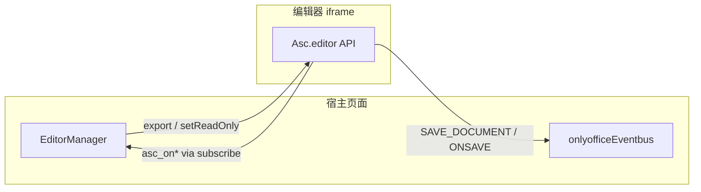

# 07 - 批注修订与 Word API

[← 注意事项](./06-注意事项与支持格式.md) | [概述](./00-概述.md)

`EditorManager` 封装了 Word 文档的批注、修订能力，以及 OnlyOffice iframe 内 SDK 的回调订阅。通过 `OnlyOfficeManager.getEditor()` 获取底层实例。

## 批注 API

```typescript
import { editorManagerFactory } from "@/components/onlyoffice-web-comp";
import type {
  CommentInput,
  CommentChangeHandlers,
} from "@/components/onlyoffice-web-comp";

const manager = editorManagerFactory.getDefault();

// 列表
const comments = manager.getAllComments();

// 新增（支持字符串或 CommentData 对象）
const id = manager.addComment("请修改此处表述");

// 更新 / 删除 / 跳转
manager.updateComment(id, { Text: "已修改说明" });
manager.removeComment(id);
manager.goToComment(id, { showBalloon: true });

// 监听批注变化（SDK 回调封装，async）
const unregister = await manager.registerCommentCallbacks({
  onAdd: (id, data) => {},
  onChange: (id, data) => {},
  onRemove: (id) => {},
});

unregister();
```

### 相关类型

- `CommentItem` — `{ Id, Data }`
- `CommentInput` — `CommentData | string`
- `CommentData` — 含 `Text`、`UserName`、`Time`、`Replies` 等

## 修订 API

```typescript
import type {
  RevisionItem,
  RevisionChangeHandlers,
} from "@/components/onlyoffice-web-comp";

manager.setTrackRevisions(true);
const tracking = manager.isTrackRevisions();
const hasChanges = manager.haveRevisionsChanges();

const revisions: RevisionItem[] = manager.getAllRevisions();

manager.goToNextRevision();
manager.goToPrevRevision();
manager.goToRevision(revisions[0].Id);

manager.acceptRevision(revisions[0]);
manager.rejectRevision(revisions[0]);
manager.acceptAllRevisions();
manager.rejectAllRevisions();
manager.acceptRevisionsBySelection(true);
manager.rejectRevisionsBySelection(true);

const unregisterRev = await manager.registerRevisionCallbacks({
  onShowChanges: (items) => {},
  onTrackRevisionsChange: (enabled) => {},
});

unregisterRev();
```

### `RevisionItem`

- `Id` — 如 `rev-0`
- `Index` — 在栈中的序号
- `Data` — 修订元数据（类型、作者、时间等）
- `Raw` — SDK 原始对象，供接受/拒绝使用

## `subscribe` — Word SDK 回调

直接订阅 `AscWordApiMethod`，底层调用 `asc_registerCallback` / `asc_unregisterCallback`：

```typescript
import type { AscWordApiMethod } from "@/components/onlyoffice-web-comp";

const unsubscribe = await manager.subscribe({
  type: "asc_onDocumentModifiedChanged" satisfies AscWordApiMethod,
  fn: (modified: unknown) => {
    console.log("文档修改状态:", modified);
  },
});

unsubscribe();
```

### 推荐回调与业务场景

| 回调 | 场景 |
|------|------|
| `asc_onAddComment` | 新增批注后同步侧栏 |
| `asc_onChangeCommentData` | 批注内容编辑 |
| `asc_onRemoveComment` | 批注删除 |
| `asc_onShowRevisionsChange` | 修订列表刷新 |
| `asc_onDocumentModifiedChanged` | 脏状态、启用保存按钮 |
| `asc_onSaveCallback` | 与编辑器内部保存链路对齐（一般由组件内部处理） |

完整方法名列表见 `type/word-api.ts`（400+ 项，覆盖内容控件、目录、脚注、合并等高级能力）。

## EventBus 与 SDK 回调的关系



- **EventBus**：跨模块、React 层监听，适合 `DOCUMENT_READY`、`LOADING_CHANGE`、带 `binData` 的保存。
- **subscribe / register*Callbacks**：贴近编辑器内部状态，适合批注、修订、修改标记等 Word 特有行为。

两者可同时使用，注意在卸载时分别清理。
